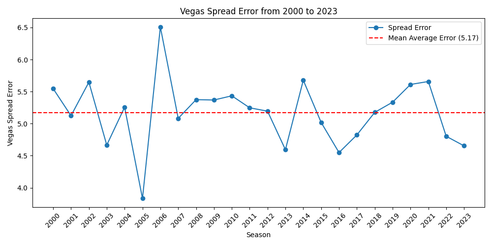
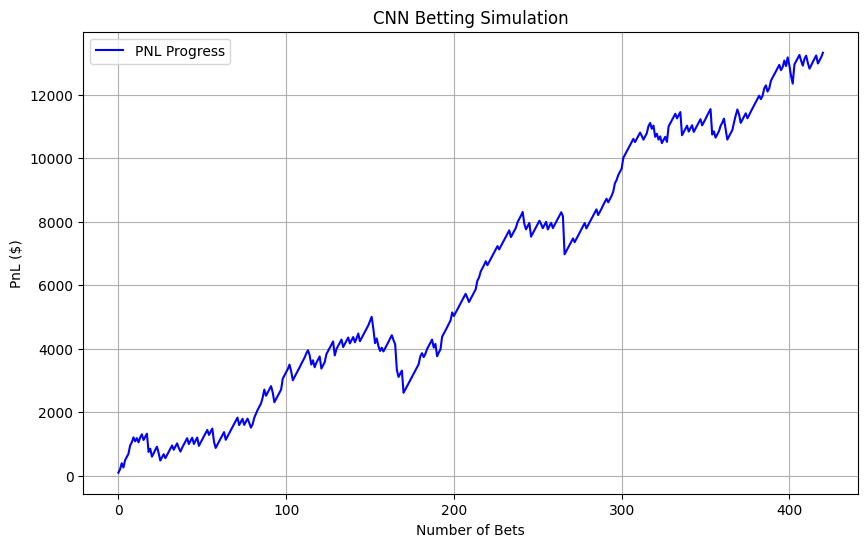

# Don't bet on sports, kids!

This project applies machine learning to the world of NFL game predictions.<br>

Check out the [Web App](https://dont-bet-on-sports-hp.streamlit.app/)!

# Table of Contents
- [Don't bet on sports, kids!](#dont-bet-on-sports-kids)
- [Table of Contents](#table-of-contents)
- [Introduction](#introduction)
  - [Project Goal](#project-goal)
  - [Motivation](#motivation)
  - [NFL Beting Primer](#nfl-beting-primer)
    - [Spread Line](#spread-line)
    - [Total Line](#total-line)
    - [Money Line](#money-line)
  - [Challenge](#challenge)
- [Project Structure](#project-structure)
- [Data](#data)
  - [Data Sources](#data-sources)
  - [Data Cleaning](#data-cleaning)
  - [Feature Engineering](#feature-engineering)
    - [Target Variable](#target-variable)
    - [Adjusted v/s Unadjusted $r\\\_spread$](#adjusted-vs-unadjusted-r_spread)
    - [Weighted Averages](#weighted-averages)
- [Modeling](#modeling)
  - [Considering Vegas' Spread](#considering-vegas-spread)
    - [Without Vegas Spread](#without-vegas-spread)
    - [With Vegas Spread](#with-vegas-spread)
  - [Convolution](#convolution)
  - [Hyperparameter Tuning](#hyperparameter-tuning)
- [Results](#results)
  - [Best Estimators](#best-estimators)
- [Web App](#web-app)
  - [Shoulders of Giants](#shoulders-of-giants)

# Introduction
## Project Goal
Create a streamlined system for predicting the outcomes of NFL (National Football League) games by estimating the unadjusted spread line for the favorites.
## Motivation
Moving to United States for my Master's was one of the, if not the biggest decision of my life. I was excited to pursue the world-class education offered here and be at the epicentre of advancements in Machine Learning and Data Science. Both these domains were relatively new to me coming from a Data Engineering background and the culture itself was novel. During my first few weeks here I had the opportunity to attend our university's college football game, my first rendezvous with American Football. The atmosphere was electric, the stage was grand and the stands full of enthusiastic students and public alike. I thoroughly enjoyed the game, with my local friends feeding me variety of rules and by $4^{th}$ quarter I understood why american football was the most popular sport in the country


All the while I was itching to get my hands dirty with some ML and so I thought to myself why not combine the new skills I was learning and the new culture I was now a part of, to create a project that also has financial and game theory aspects, both of which have been an interest of mine. Coupled with the fast-growing sports betting industry of over $10 Billion, this lucrative amalgamation of sports, money and science is what led to me to the creation of this project.

## NFL Beting Primer
### Spread Line
Spread Line or Point Spread is a number accompanied with a + or - sign that denotes the margin of victory in a game for the underdog and favourite respectively. <br> For example, a spread of -4 Vikings : Packers +4 means that the Vikings must win by more than 4 point margin over Packers to cover the bet. Conversely the Packers must either lose by 1-3 points or win outright to cover the spread. If the Vikings win by exactly 4, the bet is a ‘push’ and the bettors are refunded their wagers.

### Total Line
Total Line, also called a Over/Under is simply a sum of scores of both teams for a certain game. The bettors are betting on if the sum of scores will be over or under this total line. <br>
For example if over/under for Vikings and Packers is 50, and if the final socres for the game are 35 Vikings : Packers 25, which add up to 60, then the bettors who bet over(more) win the bet, and vice versa. Again, if the scores add upto exactly 50, the bet is a ‘push’ and the bettors are refunded their wagers.

### Money Line
Money Line is simply the odds that a specific team will win, regardless of the spread. The bettors are betting on if a certain team will win or lose. <br>
In our Vikings and Packers example, money line would be represented as -250 Vikings : Packers +160. This means that a bet of $250 on Vikings would win $100 (assuming Vikings win) and a bet of $100 on Packers would win $160 (assuming Packers win)

## Challenge
Bookmakers at Vegas delve through heaps of data to set odds for games while also adjusting for their profit share and the public's betting sentiment. Hence Vegas with its legions of data scientists and supercomputers would be hard to beat outright. What we can hope for is to find misvalued games and/or high-confidence matchups to bet on. We aim to acheive this by predicting the spread or simply the margin of victory, without the adjustments Vegas makes.

# Project Structure
This project follows the [CCDS Template](https://cookiecutter-data-science.drivendata.org/) with some modifications.
```
├── Makefile           <- Makefile with convenience commands like `make data` or `make train`
├── README.md          <- The top-level README for developers using this project.
├── data
│   ├── external       <- Data from third party sources.
│   ├── interim        <- Intermediate data that has been transformed.
│   ├── processed      <- The final, canonical data sets for modeling.
│   └── raw            <- The original, immutable data dump.
│
├── docs               <- A default mkdocs project; see www.mkdocs.org for details
│
├── models             <- Trained and serialized models, model predictions, or model summaries
│
├── notebooks          <- Jupyter notebooks.
│
├── pyproject.toml     <- Project configuration file with package metadata for 
│                         dbos and configuration for tools like black
│
│
├── reports            <- Generated analysis as HTML, PDF, LaTeX, etc.
│   └── figures        <- Generated graphics and figures to be used in reporting
│
├── requirements.txt   <- The requirements file for reproducing the analysis environment, e.g.
│                         generated with `pip freeze > requirements.txt`
│
├── setup.cfg          <- Configuration file for flake8
│
└── src   <- Source code for use in this project.
    │
    ├── __init__.py             <- Makes dbos a Python module
    │
    ├── config.py               <- Store useful variables and configuration
    │
    ├── dataset.py              <- Scripts to download or generate data
    │
    ├── features.py             <- Code to create features for modeling
    │
    ├── modeling                
    │   ├── __init__.py 
    │   ├── predict.py          <- Code to run model inference with trained models          
    │   └── train.py            <- Code to train models
    │
    ├── pipeline.py             <- Code to run the whole ML pipeline
    │
    └── reports.py              <- Code to analyze model performance and create visualizations
```

--------

# Data
To predict the outcomes of any matchup, team stats for both the home team and away team were needed. We could go one level deeper and suggest that a team is nothing more than the sum of their players, however considering the complexity that would add, we will focus solely on the team stats.
## Data Sources
Thanks to the popularity of NFL, data is available widely and freely. The single biggest source of this being [Pro Football Reference](https://www.pro-football-reference.com/) which contains everything from boxscores, player stats to the weather conditions recorded at the stadium. On top of that, PFR has a pro-scraping policy, awesome!<br>
Thanks to [NFLVerse](https://github.com/nflverse) and [NFLScraPy](https://github.com/blnkpagelabs/nflscraPy) I was able to backfill data for Seasons 2000-2023, while the current season stats and ongoing match data will be scraped directly from PFR.

## Data Cleaning
The backfilled data had certain values missing, some of which were valuable while others not so much. Depending on the size of missing subset, the values were either filled based on certain logic or were dropped entirely.

| Column | Action |
| ------ | ------ |
|won_toss_decision, won_toss_overtime, won_toss_overtime_decision, game_time, tm_pass_cmp_pct| Dropping these as they don't offer useful insights and nearly all values are missing|
|temperature, wind_speed, humidity|These are missing for domed/indoor stadiums only. These stadiums have HVAC systems to maintain a comfortable temperature for the fans and players alike. Further research shows that on average these stadiums are temperature controlled to anywhere between 65 to 75 degrees (in freedom units, unfortunately). We will fill the missing temperature values with random values within an extended range of 60-75. Referring to temperature histogram plotted in EDA notebook, we can see that these values will lie on the warmer end of the distribution, which makes sense for the comfort of players and fans. As for winds, it can be reasonably assumed that closed stadiums will have very less to no winds, so we will fill values within a range of 0-2, which is already a case for a lot of games, as can be seen by the previously plotted wind histogram. Humidity levels inside dome stadiums are usually kept between 30% and 50%, which is considered ideal for indoor environments. so we will fill values within a range of 30-50|
|attendace, duration| Dropping these as well. Future updates might consider predicting stadium wise attendance values to plug into our predictor variables|

## Feature Engineering
### Target Variable 
We want to predict the unadjusted home team spread which will be denoted as follows <br> $$r\\_spread=tm\\_score - opp\\_score$$ <br>
This target variable allows us to predict two outcomes: <br>
1. <strong>Winning Team</strong><br> If the $r\\_spread$ is negative, we can predict that the home team loses the game (by virtue of scoring less than the away team) and vice versa.
2. <strong>Margin of Victory</strong><br> The magnitude and sign of $r\\_spread$ allows us to predict the margin of victory and make bets with odds which fall within this margin. Expectedly these will be far and few.
### Adjusted v/s Unadjusted $r\\_spread$
How does Vegas come up with the $spread?$
* Vegas' assesses team strength, injuries, home/away factors, public sentiment, recent performances, and other factors like weather to create best estimate of opening point spread.
* As money flows in, sportsbooks adjust the spread to balance the betting on both sides to reduce risk exposure.
* The odds on either side of a spread are typically -110. This means you need to bet $110 to win $100.
This vig (or "juice") is how the bookmaker ensures profit. Even if the bets are split evenly between both sides, the sportsbook makes a small percentage from the vigorish.
* If more people bet on the favorite, the bookmaker shifts the spread to encourage more bets on the underdog (or vice versa). This is done to avoid being overexposed to one side of the bet.<br>
TLDR: Vegas' spread is adjusted to minimize bookmakers risk and maximize, you guessed it, bookmakers profit.<br>
Since $r\\_spread$ solely depends on the resulting margin of victory without any other adjustments, it can then be compared to Vegas' spread to pinpoint misvalued games, which can happen for example, when a large home population bets on their own team out of sentiment and so on.
### Weighted Averages
The game attributes such as pass completions, touchdowns are present for that specific game. Obviously we won't know the actual values for these attributes until the game has finished. What we need then is to look at the past performance of the teams for those specific attributes. It can also be safely assumed that a teams touchdown stats in season 2000 are not going to matter much as compared to the current season. Hence we will use todo weighted averages for these attributes.

**Consideration for Weighted Averages**
1. Since different teams can play different number of games leading upto a matchup, we will convert each stat to per game.
2. Weights $w$ would be assigned per season where *n* is the current season such that: $$w_n > w_{n-1} >> w_{n-2}...$$
3. The weather conditions will have to be estimated per stadium based on time of year and so on. We will start off with a simple average of all matches hosted at that specific stadium for now.

# Modeling
Three models were tested for regressing $r\\_spread$. 
1. Random Forests
2. Support Vectors
3. Gradient Boosted Trees
4. Plain Neural Network
5. Convolutional Neural Network
## Considering Vegas' Spread
PFR stores Vegas' spread, over/under and moneylines for past and upcoming games as well. Do we include these as predictor variables in our predictions?<br>

Including the Vegas' spread would have benefits of building our model on top of Vegas' own research. Vegas' spread is also often the strongest indicator for outright prediction of winning team. On the other hand we are explicitly trying to finds cases where Vegas' spread is wrong. So I compared models both with and without Vegas' spread to measure how our prediction of $r\\_spread$ is affected by it.<br>

### Without Vegas Spread


<br>

### With Vegas Spread


We saw a slight (and significant in case of GBT) improvements in our Mean Absolute Error (MAE) for all 3 models with Vegas' spread being included in the mix. Still we are performing much worse than Vegas is!

## Convolution
Spoiler Alert! As I developed this project, the 4 models, (random forests, SVMs, GBT and Plain NN) performed quite poorly in the simulations. This led me to look for modifications to both the data and the models. This is when I came across the following research paper [Exploiting sports-betting market using machine learning](https://www.researchgate.net/publication/331218530_Exploiting_sports-betting_market_using_machine_learning). The following were the key points highlighted:
1. Model with only team stats performed significantly worse than models that consider player stats.
2. Using Vegas' spread in your predictions leads to inherent bias in the model which negatively affects performance.

The answer to our performance woes? Convoluting on Player Stats!


I implemented the above architecture presented in the research paper with a few key modifications
1. I chose to include top 10 players based on the fantasy points exponentially averaged over last 7 games.
2. The existing team stats were added as extra_features to the dense layers instead of odds
3. The paper used BCELoss to output a win probability. My previous approach was to regress on to the r_spread value. With CNN this approach was changed to predict the winner outright and use Moneyline odds for betting. This changed the problem from regression to classification

## Hyperparameter Tuning
I used [RandomizedSearchCV](https://scikit-learn.org/1.5/modules/generated/sklearn.model_selection.RandomizedSearchCV.html#randomizedsearchcv) to perform 3-fold cross validation with 30 iterations on all 3 models, acheiving the following result. 
| Model | MAE |
| ------ | ------ |
|Plain Neural Net|11.47|
|Random Forests|9.97|
|Support Vectors|10.06|
|Gradient Boosted Trees|10.05|


The CNN wasn't tuned.

| Model | Accuracy |
| ------ | ------ |
|Convolutional Neural Network|55.74 %|
# Results
The CNN performed the best by a mile, although it must be said that it had the significant advantage of getting to use the player stats in addition to the team stats. The simulation was based on whether the prediction is higher than a threshold(0.9) for a high confidence bet.



|||
|--|--|
|Win Rate| 60.33 %|
|Return on Investment (ROI) | 14.73 %|
|Bets Won | 254 |
|Total Bets| 421 |
|Total Games| 897 |
|Total Wagered| $ 90400|
|Total PnL | $ 13321 |

So should you quit your job and start betting? No of course not. I cherry picked the threshold value for our model output probability as well as modified the betting strategy to maximize the profits. So while the simulation is an ideal scenario, it still displays the potential of a model that include players stats and team stats combined. More advanced stats that are available on PFR will further improve the performance of such a model.


## Best Estimators

Based on the chart of feature importances we can derive few potential insights:

1. **Vegas on top**<br>
tm_spread and opp_spread, both predicted by Vegas are the strongest estimators and speaks to the strength of bookmakers predictive power.
This suggests that market predictions and pre-game odds play a significant role in the model’s performance. This could indicate that point spreads are strongly correlated with team performance and outcomes.
2. **Weather factors such as humidity and temperature have meaningful impact**<br>
Features like humidity_pct and temperature are among the top contributors. Weather conditions might affect player performance (especially in outdoor games), strategy, or ball control, leading to their significance. These insights could indicate that certain teams perform better or worse under specific weather conditions.
3. **Fourth down conversion attempts and success rate are important**<br>
Metrics such as fourth_down_att and fourth_down_conv_pct show that teams' decisions to attempt fourth-down conversions, and their success rates, are key factors. This reflects coaching strategy and game aggressiveness. The importance of fourth-down conversions could indicate that taking risks on critical plays significantly affects game outcomes.
4. **Possession time matters**<br>
time_of_possession appears as a relevant feature. Teams that control the ball longer can dominate the game by tiring out the opponent’s defense or running down the clock.
5. **Penalties and turnovers influence performance**<br>
opp_penalties and tm_fumbles are important indicators, showing that discipline and ball security impact game outcomes. Teams with fewer penalties or turnovers have an advantage.
6. **Passing and rushing metrics play a role**<br>
tm_pass_int (team pass interceptions) and opp_pass_int (opponent pass interceptions) reflect the importance of turnover margins.
tm_rush_tds (team rushing touchdowns) indicate that having a strong rushing game correlates with better outcomes.
7. **Week is relevant**<br>
The feature week suggests that the performance varies across the season. This could reflect fatigue, player injuries, or weather changes across different weeks of the NFL season.

# Web App
The model is accessible with an interactive web-app. This allows users to select a home-team and an away-team, after which the model internally predicts a $r\_spread$ score and outputs and estimation of the winning team along with the predicted spread.


## Shoulders of Giants
[Hubáček, Ondřej & Šír, Gustav & Železný, Filip. (2019). Exploiting sports-betting market using machine learning. International Journal of Forecasting. 35. 10.1016/j.ijforecast.2019.01.001.](https://www.researchgate.net/publication/331218530_Exploiting_sports-betting_market_using_machine_learning) 

<h2>Thank you for visiting!</h2>


